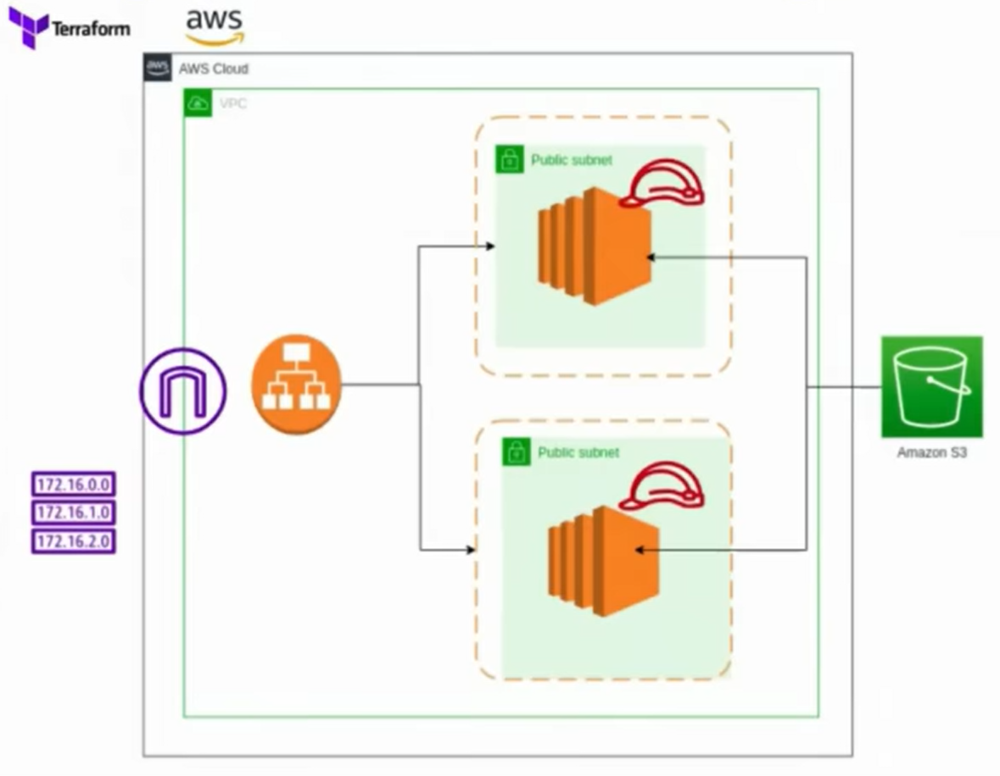
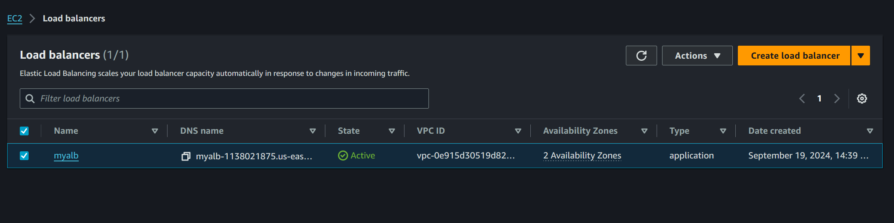
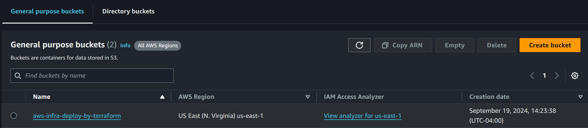
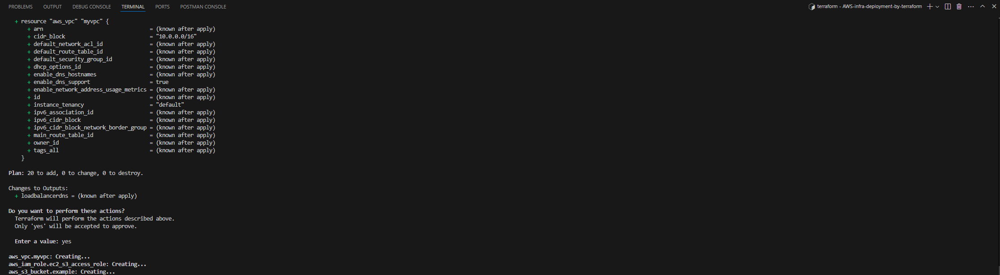
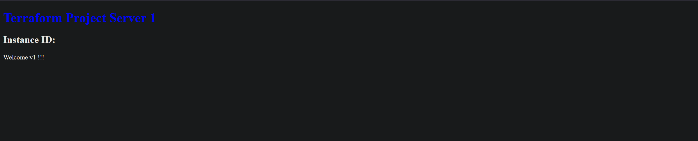
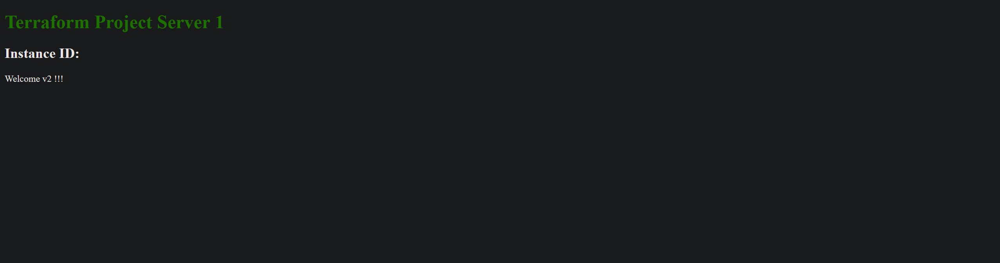
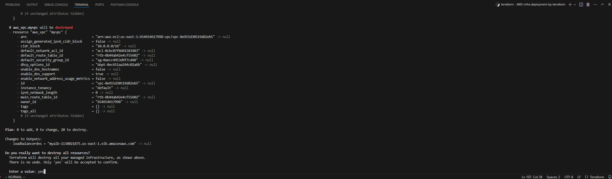

# AWS-infra-deployment-by-terraform



Created resources in AWS cloud platform with the help of Terraform.

## Steps to follow:

1. Configure aws cli in the local machine.
2. Initiate Terraform in the local machine.
3. Code the required resources.
4. Execute the terraform files.
5. Monitor and see the result.
6. Destroy the resources.

### 1. Configure aws cli in the local machine.

Configure the AWS credentials in the local machine by typing command ``` aws configure ``` i.e. :
- aws access key
- aws secret access key
- region 
- format

### 2. Initiate Terraform in the local machine.

Start Terraform in the local machine by using command ``` terraform init ```

### 3. Code the required resource.

#### a. Define a VPC and two subnets within it, each with public IPs enabled.

```hcl
# Define a VPC resource
resource "aws_vpc" "example_vpc" {
  cidr_block = var.vpc_cidr
}
```

```hcl
# Define Subnet resources
resource "aws_subnet" "example_subnet1" {
  vpc_id                  = aws_vpc.example_vpc.id
  cidr_block              = var.subnet1_cidr
  availability_zone       = var.az1
  map_public_ip_on_launch = true
}

resource "aws_subnet" "example_subnet2" {
  vpc_id                  = aws_vpc.example_vpc.id
  cidr_block              = var.subnet2_cidr
  availability_zone       = var.az2
  map_public_ip_on_launch = true
}
```


#### b. Internet Gateway and Route Table: Create an Internet Gateway and a route table to route traffic through the gateway, then associate it with subnets.

```hcl
# Define an Internet Gateway
resource "aws_internet_gateway" "example_igw" {
  vpc_id = aws_vpc.example_vpc.id
}
```

```hcl
# Define a Route Table
resource "aws_route_table" "example_route_table" {
  vpc_id = aws_vpc.example_vpc.id

  route {
    cidr_block = var.destination_cidr
    gateway_id = aws_internet_gateway.example_igw.id
  }
}

# Associate Route Table with Subnets
resource "aws_route_table_association" "example_rta1" {
  subnet_id      = aws_subnet.example_subnet1.id
  route_table_id = aws_route_table.example_route_table.id
}

resource "aws_route_table_association" "example_rta2" {
  subnet_id      = aws_subnet.example_subnet2.id
  route_table_id = aws_route_table.example_route_table.id
}
```

#### c. Security Group: Define security rules for allowing traffic (HTTP, SSH) and controlling egress.

```hcl
# Define a Security Group
resource "aws_security_group" "example_sg" {
  vpc_id = aws_vpc.example_vpc.id

  ingress {
    from_port   = var.ingress_from_port
    to_port     = var.ingress_to_port
    protocol    = var.ingress_protocol
    cidr_blocks = var.ingress_cidr_blocks
  }

  egress {
    from_port   = var.egress_from_port
    to_port     = var.egress_to_port
    protocol    = var.egress_protocol
    cidr_blocks = var.egress_cidr_blocks
  }

  tags = {
    Name = "example-sg"
  }
}
```

#### d. EC2 Instances: Define two EC2 instances, assign them a security group, user data for initialization, and attach an IAM profile for S3 access.

```hcl
# Define EC2 Instances
resource "aws_instance" "example_instance1" {
  ami                    = var.ami_id
  instance_type          = var.instance_type
  vpc_security_group_ids = [aws_security_group.example_sg.id]
  subnet_id              = aws_subnet.example_subnet1.id
  user_data              = file("path/to/userdata1.sh")
  iam_instance_profile   = aws_iam_instance_profile.example_instance_profile.name

  tags = {
    Name = "example-instance1"
  }
}

resource "aws_instance" "example_instance2" {
  ami                    = var.ami_id
  instance_type          = var.instance_type
  vpc_security_group_ids = [aws_security_group.example_sg.id]
  subnet_id              = aws_subnet.example_subnet2.id
  user_data              = file("path/to/userdata2.sh")
  iam_instance_profile   = aws_iam_instance_profile.example_instance_profile.name

  tags = {
    Name = "example-instance2"
  }
}
```


#### e. ALB (Load Balancer): Define an Application Load Balancer, target group, listener, and attach EC2 instances to the target group.

```hcl
# Define an ALB (Application Load Balancer)
resource "aws_lb" "example_alb" {
  name               = "example-alb"
  internal           = false
  load_balancer_type = "application"
  security_groups    = [aws_security_group.example_sg.id]
  subnets            = [aws_subnet.example_subnet1.id, aws_subnet.example_subnet2.id]

  tags = {
    Name = "example-alb"
  }
}
```

```hcl
# Define Target Group for ALB
resource "aws_lb_target_group" "example_tg" {
  name     = "example-tg"
  port     = 80
  protocol = "HTTP"
  vpc_id   = aws_vpc.example_vpc.id

  health_check {
    path = "/"
    port = "traffic-port"
  }
}
```

```hcl
# Attach EC2 Instances to Target Group
resource "aws_lb_target_group_attachment" "example_attachment1" {
  target_group_arn = aws_lb_target_group.example_tg.arn
  target_id        = aws_instance.example_instance1.id
  port             = 80
}

resource "aws_lb_target_group_attachment" "example_attachment2" {
  target_group_arn = aws_lb_target_group.example_tg.arn
  target_id        = aws_instance.example_instance2.id
  port             = 80
}
```

```hcl
# Define ALB Listener
resource "aws_lb_listener" "example_listener" {
  load_balancer_arn = aws_lb.example_alb.arn
  port              = 80
  protocol          = "HTTP"

  default_action {
    target_group_arn = aws_lb_target_group.example_tg.arn
    type             = "forward"
  }
}
```



#### f. IAM Roles and Policies: Define an IAM role and policy to allow EC2 instances access to an S3 bucket.

```hcl
# Define IAM Policy for S3 Access
resource "aws_iam_policy" "example_s3_policy" {
  name        = "example-s3-policy"
  description = "Allows EC2 instances to access S3"

  policy = jsonencode({
    Version = "2012-10-17"
    Statement = [{
      Action = ["s3:GetObject", "s3:PutObject", "s3:ListBucket"]
      Effect   = "Allow"
      Resource = aws_s3_bucket.example_s3_bucket.arn
    }]
  })
}
```

```hcl
# Attach IAM Policy to IAM Role
resource "aws_iam_role_policy_attachment" "example_policy_attachment" {
  role       = aws_iam_role.example_iam_role.name
  policy_arn = aws_iam_policy.example_s3_policy.arn
}
```

```hcl
# Define IAM Instance Profile
resource "aws_iam_instance_profile" "example_instance_profile" {
  name = "example-instance-profile"
  role = aws_iam_role.example_iam_role.name
}
```

#### g. S3 Bucket: Define an S3 bucket that the EC2 instances can access.
```hcl
# Define S3 Bucket
resource "aws_s3_bucket" "example_s3_bucket" {
  bucket = "example-s3-bucket"
}
```



### 4. Execute the terraform files.

- Use command ``` terraform fmt``` to make it as syntax neat as possible.
- To validate the code written, use command ``` terraform validate ```.
- To review the result of the code that has been written, type command ``` terraform validate ```.
- And finally execute the files using ``` terraform apply ``` along with "yes" when prompted.




### 5. Monitor and see the result.

Copy and paste the ALB dns link on the local browser to see the result.





### 6. Destroy the resources.

To destroy the resource, type ``` terraform destroy ``` along with "yes" when prompted.



